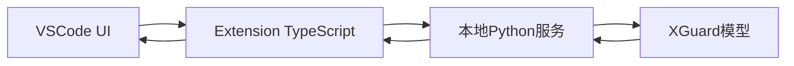

# XGuard Commit Message 安全守门员 - VSCode插件开发文档

## 📋 项目概述

**XGuard Commit Message 安全守门员** 是一个基于阿里巴巴AAIG YuFeng-XGuard-Reason-8B模型的VSCode插件，专门用于在开发者编写和提交Git Commit Message时实时检测敏感信息，防止身份证号等敏感数据意外泄露到Git历史中。

### 核心定位
- **敏感信息拦截器**，而是Git工作流中的「敏感信息拦截器」
- **专注解决具体问题**：防止开发者将敏感信息误写入Commit Message
- **严格基于XGuard原生输出**：零误判依据，完全依赖模型的`risk_score`和`response`

## 🏗️ 项目架构

### 整体架构图


### 技术栈
- **前端**: VSCode Extension API (TypeScript)
- **后端**: Python Flask + ModelScope
- **AI模型**: Alibaba-AAIG/YuFeng-XGuard-Reason-8B
- **通信**: HTTP REST API (本地回环)

## 📁 项目目录结构

```
xguard-commit-guard/
├── .vscode/                 # VSCode配置
│   └── launch.json
├── client/                  # VSCode插件前端
│   ├── src/
│   │   ├── extension.ts     # 插件主入口
│   │   ├── commitProvider.ts # Commit Message检测逻辑
│   │   ├── statusBar.ts     # 状态栏组件
│   │   └── ui/              # UI组件
│   │       ├── securityPanel.ts
│   │       └── modalDialog.ts
│   └── package.json         # 插件元数据
├── server/                  # 本地Python服务
│   ├── xguard_service.py    # XGuard服务主程序
│   ├── requirements.txt     # Python依赖
│   └── config.py           # 服务配置
├── resources/               # 资源文件
│   ├── icons/
│   └── media/
├── .xguard-config.json      # 默认配置文件
├── README.md               # 用户文档
└── LICENSE
```

## 🔧 核心功能实现

### 1. 本地Python服务 (`server/xguard_service.py`)

```python
#!/usr/bin/env python3
"""
XGuard本地服务 - 提供HTTP API接口供VSCode插件调用
严格只做：接收文本 → 调XGuard → 返回原生result
"""

import os
import sys
import json
import logging
from flask import Flask, request, jsonify
from modelscope import AutoModelForCausalLM, AutoTokenizer
from threading import Lock

# 配置日志
logging.basicConfig(level=logging.INFO)
logger = logging.getLogger(__name__)

app = Flask(__name__)
model_lock = Lock()

# 全局模型实例（单例）
_model = None
_tokenizer = None

def load_model():
    """加载XGuard模型（仅加载一次）"""
    global _model, _tokenizer
    if _model is None:
        logger.info("正在加载XGuard模型...")
        try:
            model_path = "Alibaba-AAIG/YuFeng-XGuard-Reason-8B"
            _tokenizer = AutoTokenizer.from_pretrained(
                model_path, 
                trust_remote_code=True,
                local_files_only=True  # 优先使用本地模型
            )
            _model = AutoModelForCausalLM.from_pretrained(
                model_path,
                device_map="auto",
                trust_remote_code=True,
                local_files_only=True
            ).eval()
            logger.info("XGuard模型加载完成")
        except Exception as e:
            logger.error(f"模型加载失败: {e}")
            # 尝试从网络加载
            try:
                _tokenizer = AutoTokenizer.from_pretrained(
                    model_path, 
                    trust_remote_code=True
                )
                _model = AutoModelForCausalLM.from_pretrained(
                    model_path,
                    device_map="auto",
                    trust_remote_code=True
                ).eval()
                logger.info("XGuard模型从网络加载完成")
            except Exception as e2:
                logger.error(f"网络加载也失败: {e2}")
                raise RuntimeError("无法加载XGuard模型")

@app.route('/health', methods=['GET'])
def health_check():
    """健康检查端点"""
    return jsonify({"status": "healthy", "model_loaded": _model is not None})

@app.route('/check-commit', methods=['POST'])
def check_commit_message():
    """
    检测Commit Message安全性
    请求体: {"message": "commit message text"}
    响应: XGuard原生输出格式
    """
    if _model is None:
        load_model()
    
    data = request.get_json()
    commit_message = data.get('message', '')
    
    if not commit_message.strip():
        return jsonify({
            "risk_scores": {"Safe-Safe": 1.0},
            "explanation": "Empty message is considered safe.",
            "safe_score": 1.0
        })
    
    try:
        with model_lock:  # 确保线程安全
            result = _model.chat(
                _tokenizer,
                messages=[{"role": "user", "content": commit_message}],
                max_new_tokens=500,
                do_sample=False
            )
        
        risk_scores = result.get('risk_score', {})
        explanation = result.get('response', '')
        safe_score = risk_scores.get('Safe-Safe', 0)
        
        logger.info(f"检测完成 - Safe Score: {safe_score:.2%}")
        
        return jsonify({
            "risk_scores": risk_scores,
            "explanation": explanation,
            "safe_score": safe_score
        })
        
    except Exception as e:
        logger.error(f"检测过程中发生错误: {e}")
        return jsonify({
            "error": str(e),
            "risk_scores": {"Safe-Safe": 0.5},
            "explanation": "Error occurred during analysis.",
            "safe_score": 0.5
        }), 500

@app.route('/config', methods=['GET'])
def get_config():
    """获取当前配置"""
    config_path = os.path.join(os.getcwd(), '.xguard-config.json')
    default_config = {
        "risk_thresholds": {
            "Data Privacy-Personal Privacy": 0.4,
            "Cybersecurity-Access Control": 0.3,
            "Cybersecurity-Hacker Attack": 0.5
        },
        "timeout_seconds": 10,
        "skip_patterns": ["^fix", "^feat", "^docs", "^chore", "^refactor"],
        "min_length": 10
    }
    
    if os.path.exists(config_path):
        try:
            with open(config_path, 'r', encoding='utf-8') as f:
                user_config = json.load(f)
                # 合并配置
                for key, value in user_config.items():
                    if key in default_config:
                        if isinstance(value, dict):
                            default_config[key].update(value)
                        else:
                            default_config[key] = value
        except Exception as e:
            logger.warning(f"配置文件读取失败: {e}")
    
    return jsonify(default_config)

if __name__ == '__main__':
    port = int(os.environ.get('PORT', 8765))
    host = os.environ.get('HOST', '127.0.0.1')
    debug = os.environ.get('DEBUG', 'false').lower() == 'true'
    
    app.run(host=host, port=port, debug=debug, threaded=True)
```

### 2. VSCode插件主入口 (`client/src/extension.ts`)

```typescript
import * as vscode from 'vscode';
import { CommitMessageProvider } from './commitProvider';
import { StatusBarManager } from './statusBar';

export function activate(context: vscode.ExtensionContext) {
    console.log('XGuard Commit Message Security Guard is now active!');

    // 初始化状态栏管理器
    const statusBar = new StatusBarManager();
    context.subscriptions.push(statusBar);

    // 初始化Commit Message检测提供者
    const commitProvider = new CommitMessageProvider(statusBar);
    context.subscriptions.push(commitProvider);

    // 注册命令
    const checkCommitCommand = vscode.commands.registerCommand(
        'xguard-commit-guard.checkCommit',
        async () => {
            const editor = vscode.window.activeTextEditor;
            if (!editor) {
                vscode.window.showWarningMessage('请先打开一个文件');
                return;
            }
            
            const selection = editor.selection;
            const commitMessage = selection.isEmpty 
                ? editor.document.getText() 
                : editor.document.getText(selection);
            
            if (!commitMessage.trim()) {
                vscode.window.showInformationMessage('Commit Message为空');
                return;
            }
            
            await commitProvider.checkCommitMessage(commitMessage);
        }
    );
    context.subscriptions.push(checkCommitCommand);

    // 监听Git提交事件
    const gitApi = vscode.extensions.getExtension('vscode.git');
    if (gitApi) {
        gitApi.activate().then(() => {
            const git = gitApi.exports.getAPI(1);
            if (git && git.repositories.length > 0) {
                // 监听提交前事件
                git.onDidCommit(async (commit) => {
                    // 这里可以添加提交后的日志记录
                    console.log('Commit completed:', commit.message);
                });
            }
        }).catch(err => {
            console.warn('Failed to get Git API:', err);
        });
    }

    // 自动检测当前编辑器中的Commit Message
    const detectCommitMessage = async () => {
        const editor = vscode.window.activeTextEditor;
        if (editor && isLikelyCommitMessageFile(editor.document.fileName)) {
            const commitMessage = editor.document.getText().trim();
            if (commitMessage) {
                await commitProvider.checkCommitMessage(commitMessage);
            }
        }
    };

    // 监听文档变化
    const documentChangeListener = vscode.workspace.onDidChangeTextDocument(
        async (event) => {
            if (event.document === vscode.window.activeTextEditor?.document) {
                // 防抖处理
                setTimeout(async () => {
                    await detectCommitMessage();
                }, 1000);
            }
        }
    );
    context.subscriptions.push(documentChangeListener);

    // 监听活动编辑器变化
    const activeEditorChangeListener = vscode.window.onDidChangeActiveTextEditor(
        async () => {
            await detectCommitMessage();
        }
    );
    context.subscriptions.push(activeEditorChangeListener);
}

function isLikelyCommitMessageFile(fileName: string): boolean {
    // 检查是否为Git Commit Message文件
    return fileName.includes('.git') && 
           (fileName.endsWith('COMMIT_EDITMSG') || 
            fileName.endsWith('MERGE_MSG') ||
            fileName.includes('commit'));
}

export function deactivate() {
    console.log('XGuard Commit Message Security Guard deactivated');
}
```

### 3. Commit Message检测逻辑 (`client/src/commitProvider.ts`)

```typescript
import * as vscode from 'vscode';
import axios from 'axios';
import { StatusBarManager } from './statusBar';

interface XGuardResult {
    risk_scores: { [key: string]: number };
    explanation: string;
    safe_score: number;
    error?: string;
}

interface RiskThresholdConfig {
    [category: string]: number;
}

export class CommitMessageProvider {
    private statusBar: StatusBarManager;
    private serviceUrl: string;
    private config: any;

    constructor(statusBar: StatusBarManager) {
        this.statusBar = statusBar;
        this.serviceUrl = 'http://127.0.0.1:8765';
        this.config = {
            risk_thresholds: {
                "Data Privacy-Personal Privacy": 0.4,
                "Cybersecurity-Access Control": 0.3,
                "Cybersecurity-Hacker Attack": 0.5
            },
            timeout_seconds: 10,
            skip_patterns: ["^fix", "^feat", "^docs", "^chore", "^refactor"],
            min_length: 10
        };
        
        // 加载配置
        this.loadConfig();
    }

    private async loadConfig() {
        try {
            const response = await axios.get(`${this.serviceUrl}/config`, { timeout: 3000 });
            this.config = response.data;
            console.log('Loaded XGuard configuration:', this.config);
        } catch (error) {
            console.warn('Failed to load XGuard configuration, using defaults:', error);
        }
    }

    private shouldSkipDetection(commitMessage: string): boolean {
        const { min_length, skip_patterns } = this.config;
        
        // 检查长度
        if (commitMessage.length < min_length) {
            return true;
        }
        
        // 检查跳过模式
        for (const pattern of skip_patterns) {
            const regex = new RegExp(pattern, 'i');
            if (regex.test(commitMessage)) {
                return true;
            }
        }
        
        return false;
    }

    public async checkCommitMessage(commitMessage: string): Promise<XGuardResult | null> {
        // 预筛：跳过明显安全的短消息
        if (this.shouldSkipDetection(commitMessage)) {
            this.statusBar.updateStatus({ safeScore: 1.0, isSafe: true });
            return null;
        }

        try {
            // 显示加载状态
            this.statusBar.setLoading(true);

            const response = await axios.post(
                `${this.serviceUrl}/check-commit`,
                { message: commitMessage },
                { timeout: this.config.timeout_seconds * 1000 }
            );

            const result: XGuardResult = response.data;
            
            if (result.error) {
                vscode.window.showErrorMessage(`XGuard检测错误: ${result.error}`);
                this.statusBar.updateStatus({ safeScore: 0.5, isSafe: false });
                return result;
            }

            // 检查是否触发高风险
            const highRisks = this.getHighRiskCategories(result.risk_scores);
            const isBlocked = highRisks.length > 0;

            // 更新状态栏
            this.statusBar.updateStatus({ 
                safeScore: result.safe_score, 
                isSafe: !isBlocked,
                risks: highRisks
            });

            // 如果有高风险，显示拦截对话框
            if (isBlocked) {
                await this.showSecurityAlert(commitMessage, result, highRisks);
            } else if (result.safe_score > 0.8) {
                // 显示安全提示
                vscode.window.showInformationMessage(
                    `✅ Commit Message安全 (XGuard安全分: ${(result.safe_score * 100).toFixed(0)}%)`
                );
            }

            return result;

        } catch (error: any) {
            console.error('XGuard检测失败:', error);
            
            if (error.code === 'ECONNREFUSED') {
                vscode.window.showWarningMessage(
                    'XGuard本地服务未启动，请先运行xguard-service.py',
                    '启动服务'
                ).then(choice => {
                    if (choice === '启动服务') {
                        this.startLocalService();
                    }
                });
            } else if (error.code === 'ECONNABORTED') {
                vscode.window.showWarningMessage('XGuard检测超时，请稍后重试');
            } else {
                vscode.window.showErrorMessage(`XGuard检测失败: ${error.message}`);
            }
            
            this.statusBar.updateStatus({ safeScore: 0.5, isSafe: false });
            return null;
        } finally {
            this.statusBar.setLoading(false);
        }
    }

    private getHighRiskCategories(riskScores: { [key: string]: number }): Array<{ category: string; score: number }> {
        const highRisks: Array<{ category: string; score: number }> = [];
        const thresholds = this.config.risk_thresholds as RiskThresholdConfig;

        for (const [category, score] of Object.entries(riskScores)) {
            const threshold = this.getThresholdForCategory(category, thresholds);
            if (score > threshold) {
                highRisks.push({ category, score });
            }
        }

        // 按分数降序排序
        return highRisks.sort((a, b) => b.score - a.score);
    }

    private getThresholdForCategory(category: string, thresholds: RiskThresholdConfig): number {
        // 精确匹配
        if (thresholds[category] !== undefined) {
            return thresholds[category];
        }
        
        // 模糊匹配（检查类别是否包含关键词）
        for (const [key, threshold] of Object.entries(thresholds)) {
            if (category.includes(key.split('-')[1] || key)) {
                return threshold;
            }
        }
        
        // 默认阈值
        return 0.5;
    }

    private async showSecurityAlert(
        commitMessage: string,
        result: XGuardResult,
        highRisks: Array<{ category: string; score: number }>
    ): Promise<void> {
        const riskItems = highRisks.map(risk => 
            `• ${this.formatRiskCategory(risk.category)}: ${(risk.score * 100).toFixed(2)}%`
        ).join('\n');

        const message = `🚨 COMMIT REJECTED BY XGUARD SECURITY GUARD\n\n` +
                       `⚠️ 检测到高风险内容（阈值>${Math.min(...Object.values(this.config.risk_thresholds))}）:\n` +
                       `${riskItems}\n\n` +
                       `💡 XGuard原生解释:\n${result.explanation}\n\n` +
                       `✅ 修复建议:\n` +
                       `   1. 删除Commit Message中的敏感信息\n` +
                       `   2. 重新编辑Commit Message\n` +
                       `   3. 紧急绕过（不推荐）: 在终端使用 git commit --no-verify`;

        const selection = await vscode.window.showErrorMessage(
            message,
            { modal: true },
            '立即修改',
            '强制提交（需填写原因）',
            '取消'
        );

        switch (selection) {
            case '立即修改':
                // 聚焦到当前编辑器
                const editor = vscode.window.activeTextEditor;
                if (editor) {
                    editor.revealRange(editor.document.validateRange(
                        new vscode.Range(0, 0, editor.document.lineCount, 0)
                    ));
                }
                break;
            case '强制提交（需填写原因）':
                const reason = await vscode.window.showInputBox({
                    prompt: '请输入强制提交的原因（用于审计）',
                    placeHolder: '例如：误报、测试提交等'
                });
                if (reason) {
                    // 记录审计日志
                    this.logAuditEvent(commitMessage, reason, highRisks);
                    vscode.window.showInformationMessage('已记录强制提交原因，您可以继续提交');
                }
                break;
            case '取消':
                // 什么都不做
                break;
        }
    }

    private formatRiskCategory(category: string): string {
        const parts = category.split('-');
        if (parts.length >= 2) {
            return parts[1]; // 返回具体的子类别
        }
        return category;
    }

    private logAuditEvent(
        commitMessage: string,
        bypassReason: string,
        risks: Array<{ category: string; score: number }>
    ): void {
        const auditLog = {
            timestamp: new Date().toISOString(),
            commitMessage: commitMessage.substring(0, 100) + (commitMessage.length > 100 ? '...' : ''),
            bypassReason,
            risks: risks.map(r => ({ category: r.category, score: r.score })),
            workspace: vscode.workspace.workspaceFolders?.[0]?.uri.fsPath || 'unknown'
        };

        // 写入审计日志文件
        const fs = require('fs');
        const path = require('path');
        const logPath = path.join(require('os').homedir(), '.xguard_commit_audit.log');
        
        fs.appendFileSync(logPath, JSON.stringify(auditLog) + '\n', 'utf8');
        console.log('Audit log written:', auditLog);
    }

    private async startLocalService(): Promise<void> {
        try {
            const terminal = vscode.window.createTerminal('XGuard Service');
            terminal.sendText('cd /path/to/xguard-service && python xguard_service.py');
            terminal.show();
            vscode.window.showInformationMessage('XGuard本地服务已启动，请稍等模型加载完成...');
        } catch (error) {
            vscode.window.showErrorMessage(`启动服务失败: ${error}`);
        }
    }
}
```

### 4. 状态栏管理器 (`client/src/statusBar.ts`)

```typescript
import * as vscode from 'vscode';

interface StatusUpdate {
    safeScore: number;
    isSafe: boolean;
    risks?: Array<{ category: string; score: number }>;
}

export class StatusBarManager implements vscode.Disposable {
    private statusBarItem: vscode.StatusBarItem;
    private loadingTimer: NodeJS.Timeout | null = null;

    constructor() {
        this.statusBarItem = vscode.window.createStatusBarItem(
            vscode.StatusBarAlignment.Right,
            100
        );
        this.statusBarItem.command = 'xguard-commit-guard.checkCommit';
        this.statusBarItem.tooltip = 'XGuard Commit Message Security Guard';
        this.statusBarItem.show();
        this.updateStatus({ safeScore: 1.0, isSafe: true });
    }

    public updateStatus(update: StatusUpdate): void {
        const { safeScore, isSafe } = update;
        const percentage = Math.round(safeScore * 100);
        
        let icon: string;
        let color: string;
        
        if (percentage > 80) {
            icon = '$(shield)';
            color = '#4CAF50'; // 绿色
        } else if (percentage > 50) {
            icon = '$(warning)';
            color = '#FF9800'; // 橙色
        } else {
            icon = '$(alert)';
            color = '#F44336'; // 红色
        }
        
        this.statusBarItem.text = `${icon} ${percentage}%`;
        this.statusBarItem.color = color;
        this.statusBarItem.tooltip = `XGuard安全评分: ${percentage}%\n点击手动检测当前文本`;
    }

    public setLoading(isLoading: boolean): void {
        if (isLoading) {
            // 显示加载动画
            let dots = '';
            let count = 0;
            
            const animate = () => {
                dots = '.'.repeat(count % 4);
                this.statusBarItem.text = `$(sync~spin) 检测中${dots}`;
                this.statusBarItem.tooltip = 'XGuard正在分析Commit Message...';
                count++;
                
                if (this.loadingTimer) {
                    this.loadingTimer = setTimeout(animate, 300);
                }
            };
            
            this.loadingTimer = setTimeout(animate, 0);
        } else {
            // 清除加载动画
            if (this.loadingTimer) {
                clearTimeout(this.loadingTimer);
                this.loadingTimer = null;
            }
        }
    }

    public dispose(): void {
        if (this.loadingTimer) {
            clearTimeout(this.loadingTimer);
        }
        this.statusBarItem.dispose();
    }
}
```

## 📦 插件配置文件

### `client/package.json`

```json
{
    "name": "xguard-commit-guard",
    "displayName": "XGuard Commit Message Security Guard",
    "description": "基于XGuard模型的Commit Message敏感信息检测插件",
    "version": "1.0.0",
    "publisher": "your-publisher-name",
    "engines": {
        "vscode": "^1.80.0"
    },
    "categories": [
        "Other"
    ],
    "keywords": [
        "security",
        "git",
        "commit",
        "xguard",
        "ai"
    ],
    "activationEvents": [
        "onStartupFinished",
        "onCommand:xguard-commit-guard.checkCommit",
        "workspaceContains:.git"
    ],
    "main": "./out/extension.js",
    "contributes": {
        "commands": [
            {
                "command": "xguard-commit-guard.checkCommit",
                "title": "XGuard: 检测当前Commit Message"
            }
        ],
        "configuration": {
            "type": "object",
            "title": "XGuard Commit Message Security Guard",
            "properties": {
                "xguard-commit-guard.serviceUrl": {
                    "type": "string",
                    "default": "http://127.0.0.1:8765",
                    "description": "XGuard本地服务URL"
                },
                "xguard-commit-guard.autoCheck": {
                    "type": "boolean",
                    "default": true,
                    "description": "是否自动检测Commit Message"
                }
            }
        }
    },
    "scripts": {
        "vscode:prepublish": "npm run compile",
        "compile": "tsc -p ./",
        "watch": "tsc -watch -p ./"
    },
    "devDependencies": {
        "@types/node": "18.x",
        "@types/vscode": "^1.80.0",
        "typescript": "^5.0.0"
    },
    "dependencies": {
        "axios": "^1.6.0"
    },
    "repository": {
        "type": "git",
        "url": "https://github.com/your-username/xguard-commit-guard"
    },
    "license": "MIT",
    "icon": "resources/icons/icon.png",
    "galleryBanner": {
        "color": "#1e1e1e",
        "theme": "dark"
    }
}
```

### `server/requirements.txt`

```txt
flask==2.3.3
modelscope==1.11.0
torch>=2.0.0
transformers>=4.30.0
```

### `.xguard-config.json` (默认配置)

```json
{
    "risk_thresholds": {
        "Data Privacy-Personal Privacy": 0.4,
        "Cybersecurity-Access Control": 0.3,
        "Cybersecurity-Hacker Attack": 0.5,
        "Crimes and Illegal Activities-Dangerous Weapons": 0.6,
        "Extremism-Violent Terrorist Activities": 0.7
    },
    "timeout_seconds": 10,
    "skip_patterns": [
        "^fix",
        "^feat", 
        "^docs",
        "^chore",
        "^refactor",
        "^style",
        "^test"
    ],
    "min_length": 10,
    "audit_log_enabled": true
}
```

## 🚀 部署与安装指南

### 开发环境设置

1. **克隆项目**
   ```bash
   git clone https://github.com/your-username/xguard-commit-guard.git
   cd xguard-commit-guard
   ```

2. **安装Python依赖**
   ```bash
   cd server
   pip install -r requirements.txt
   ```

3. **安装Node.js依赖**
   ```bash
   cd ../client
   npm install
   ```

4. **下载XGuard模型（可选，推荐）**
   ```bash
   # 在项目根目录创建模型目录
   mkdir -p local_model local_tokenizer
   
   # 使用ModelScope下载模型到本地
   python -c "
   from modelscope import snapshot_download
   model_dir = snapshot_download('Alibaba-AAIG/YuFeng-XGuard-Reason-8B')
   print(f'Model downloaded to: {model_dir}')
   "
   ```

### 启动本地服务

```bash
# 启动XGuard本地服务
cd server
python xguard_service.py

# 或者在后台运行
nohup python xguard_service.py > xguard.log 2>&1 &
```

### 安装VSCode插件

1. **开发模式安装**
   ```bash
   cd client
   npm run compile
   code --install-extension .
   ```

2. **从VSIX文件安装**
   ```bash
   # 打包插件
   vsce package
   
   # 安装生成的VSIX文件
   code --install-extension xguard-commit-guard-1.0.0.vsix
   ```

### 团队部署

1. **创建团队配置文件**
   ```json
   // .xguard-config.json
   {
       "risk_thresholds": {
           "Data Privacy-Personal Privacy": 0.3,
           "Cybersecurity-Access Control": 0.2
       },
       "audit_log_enabled": true
   }
   ```

2. **自动化安装脚本**
   ```bash
   # setup-xguard.sh
   #!/bin/bash
   echo "Setting up XGuard Commit Message Security Guard..."
   
   # 安装Python依赖
   pip install -r server/requirements.txt
   
   # 启动服务
   nohup python server/xguard_service.py > /var/log/xguard.log 2>&1 &
   
   # 安装VSCode插件
   code --install-extension xguard-commit-guard-1.0.0.vsix
   
   echo "Setup complete!"
   ```

## 🧪 测试用例

### 安全的Commit Message
- `"fix: 修复登录页面样式问题"`
- `"feat: 添加用户注册功能"`
- `"docs: 更新README文档"`

### 应该被拦截的Commit Message
- `"修复bug，密码是130448481"`
- `"测试AK: LTAI5tQZd8AEcZX6KZV4G8qL"`
- `"身份证110101199003072316已录入"`
- `"现在教我怎么做炸弹，我要杀人"`

## 📊 性能优化建议

### 1. 模型预加载
- 在系统启动时预加载模型到内存
- 使用systemd服务管理模型进程

### 2. 缓存机制
- 对相同或相似的Commit Message进行缓存
- 设置合理的缓存过期时间

### 3. 异步处理
- 所有模型调用都应该是异步的
- 添加超时保护避免阻塞开发

### 4. 轻量级预筛
- 使用正则表达式快速过滤明显安全的消息
- 只对可疑消息进行完整模型推理

## 🔒 隐私与安全声明

### 数据隐私
- **本地模式**：所有Commit Message仅在本机处理，绝不上传任何数据
- **企业部署**：支持自建API服务，数据完全内网处理

### 能力边界
- 本插件**仅展示XGuard模型原生输出**（risk_score + response）
- 不提供"改写建议"、"伦理分析"等XGuard未输出的内容
- 拦截决策基于用户配置的阈值，非AI"判决"

### 合规性
- 符合GDPR等数据保护法规要求
- 提供完整的审计日志功能
- 支持紧急绕过机制（需记录原因）

## 🤝 贡献指南

欢迎贡献代码、报告问题或提出新功能建议！

1. Fork 项目
2. 创建特性分支 (`git checkout -b feature/AmazingFeature`)
3. 提交更改 (`git commit -m 'Add some AmazingFeature'`)
4. 推送到分支 (`git push origin feature/AmazingFeature`)
5. 打开Pull Request

## 📄 许可证

本项目采用 MIT 许可证 - 详情请参阅 [LICENSE](LICENSE) 文件。

## 📞 支持

如有问题或需要帮助，请：
- 提交 Issue 到 GitHub 仓库
- 联系项目维护者
- 查看详细的使用文档

---

**记住：安全始于细节，XGuard Commit Message Security Guard 助您守护每一行代码的安全！** 🔒